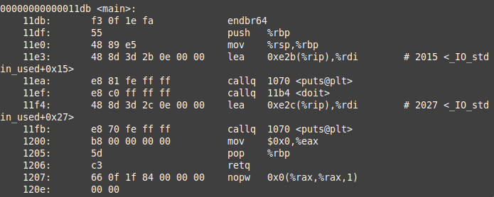

## Was machen wir?

Wir wollen einen Zeiger überschreiben, der dafür verantwortlich ist, eine Adresse anzugeben, wo das Programm nach der aktuellen Funktion fortgesetzt werden soll.

Der Zeiger, den ihr überschreiben wollt, ist: **der gespeicherte RIP (Instruction Pointer)**, der im Stackframe gespeichert ist (siehe mit _info frame_ während des Debuggens in gdb).
Dieser Zeiger ist entscheidend, da er dem Programm mitteilt, wohin es nach Abschluss der aktuellen Funktion zurückkehren soll.


### Wie man example01 verwendet

Um zu kompilieren:
```shell
gcc -fno-stack-protector -z execstack -o example01 example01.c
```
So erhalten wir eine ausführbare Datei "example01", die wir ausführen können.

#### Übung 1
Führt die Datei aus und gebt etwas Text ein. Wie viele Zeichen führen zu einem Fehler?


#### Übung 2
Aufgrund der Konstruktion des Stackframes subtrahiert 8 von der gefundenen Zahl. Dies ist die Größe eures Buffers, die ihr im Quellcode sehen könnt. Startet die ausführbare Datei im Debugger.
```shell
gdb ./example01
break your_input
break doit
```
Erklärung:  
  Der erste Befehl öffnet example01 im GNU Debugger (gdb).  
  Die nächsten Befehle erstellen Breakpoints bei den Funktionen your_input und doit. Wenn das Programm diese Funktionen ausführen soll, stoppt es, damit wir uns den Zustand ansehen können.

Startet das Programm mit dem "run"-Befehl und betrachtet den Stack. Gebt 8 'A' ein (ASCII-Code in Hex für A ist 41). Könnt ihr es finden?
```shell
run
x/32x $rsp
continue
AAAAAAAA
x/32x $rsp
continue
```
Ihr könnt auch einfach 'c' eingeben und mit Enter bestätigen, um fortzufahren, anstatt das gesamte Wort zu schreiben.

#### Übung 3
Jetzt, da ihr wisst, wie man Breakpoints erstellt, den Stack ansieht und fortführt, seid ihr fast bereit, diese und hoffentlich auch die nächste Aufgabe zu lösen.

Aber was ihr noch wissen müsst, ist:
- Wie finde ich die Adresse der Anweisung, die ich ausführen möchte?

In diesem Beispiel möchten wir die Return-Anweisung der main-Funktion ausführen, um die zweite Nachricht zu vermeiden (diese hier ->"or... maybe not?").

Dazu öffnet in einem anderen Terminal ein neues Fenster, navigiert zum example01-Verzeichnis und führt folgenden Befehl aus, um den Code zu deassemblieren:
```shell
objdump -d example01
```
Sucht nach der retq-Anweisung in der main-Funktion. Berechnet die Differenz zwischen der Adresse von <_main> und der retq-Anweisung.


Kehrt nun zum Debugger-Fenster zurück und gebt ein:
```shell
run
info address main
```
Kopiert die Adresse und addiert die zuvor berechnete Zahl. Denkt daran, dass es sich um Hex-Werte handelt, also verwendet eure Lieblingsprogrammiersprache oder ein Online-Tool, um das Ergebnis zu berechnen.

Welches Ergebnis haben Sie erhalten? Sieht irgendein Teil ähnlich aus wie die Objdump-Ausgabe?

#### Übung 4

Die folgenden Schritte führt ihr in einem anderen Terminal aus. Schließt den Debugger nicht, damit ihr die Breakpoints nicht erneut setzen müsst.
Erstellt eine Payload, indem ihr ein Python-Skript in eurem bevorzugten Texteditor (hoffentlich vim :-D) anpasst. Ihr müsst nur die Adresse in der 5. Zeile („print_flag_address“-Variable) ändern.
```shell
vim ../helper.py
```
Speichert die Datei mit :wq.

Führt das Skript aus, um die Datei payload.bin im aktuellen Verzeichnis zu erstellen.
```shell
python3 ../helper.py
```
Wie sieht die Payload aus? Könnt ihr die Struktur erklären?

#### Übung 5

Wechselt zum Debugger-Fenster zurück und gebt ein:
```shell
run < payload.bin
info frame
x/32x $rsp
c
info frame
x/32x $rsp
c
```
Seht ihr die Adresse, die injiziert wurde?

### WICHTIGSTE GDB-BEFEHLE

next - springt eine Zeile weiter im Programm
continue - führt bis zum nächsten Breakpoint fort
x/32x $rsp - zeigt 32 Blöcke (jeweils bestehend aus 8 * 16 Bits in Hex) an
info frame - zeigt Informationen über das aktuelle Stackframe an
break - erstellt einen Breakpoint

b <function_name> ; erstellt einen Breakpoint bei einer Funktion
Zum Beispiel:
```shell
b your_input
```

p <function_name> ; gibt die aktuelle Adresse der Anweisung aus. Dies muss normalerweise während der Programmausführung an einem Breakpoint erfolgen, um die Adresse zu finden, die ihr an helper.py übergeben wollt.
Zum Beispiel:
```shell
p your_input
