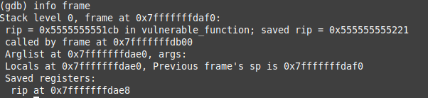

## Wie man example02 verwendet

In diesem Beispiel sollt ihr gdb (Debugger für C-Programme) nutzen, um die Flagge zu erlangen. Es ist nicht einfach. Verwendet die Cheatsheets aus example1 und fragt uns bei Problemen!

Ihr habt in diesem Beispiel eine bereits kompilierte Datei. Ihr wisst, dass die Eingabe unsicher ist und anfällig für einen Buffer Overflow.

Vorgehensweise:

1. Findet die Größe des Buffers:
Nutzt den Befehl _info frame_ und vergleicht die lokalen Variablen bei 0x... mit dem Stackpointer des vorherigen Frames (sp ist 0x...). Die Differenz zwischen den beiden Adressen ist die Größe des Arrays.

2. Ermittelt den nötigen Platz für den Overflow:
Bestimmt, wie viel zusätzlicher Speicherplatz benötigt wird, nachdem das Array vollständig gefüllt ist, um die Adresse der gewünschten Anweisung zu injizieren.
3. Dekompiliert die ausführbare Datei:
Nutzt den Befehl objdump -d example2, um den Assemblercode anzusehen, und sucht nach der Funktion print_flag. Könnt ihr anhand des Namens und des Assemblercodes erraten, was diese Funktion macht?
4. Findet die Adresse der Funktion:
Führt die Datei im gdb aus und nutzt den Befehl p print_flag, um die Adresse der Funktion zu ermitteln.
5. Passt das Python-Hilfsskript an:
Modifiziert das Skript so, dass es die richtige Payload generiert.
6. Führt das Programm mit der binären Payload aus.

Habt ihr es geschafft, die versteckte Funktion auszuführen?
